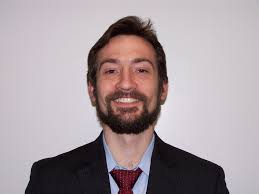
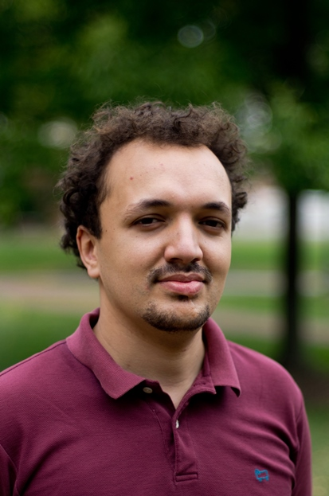

# About

Our work is ongoing, but here's some of what we're up to.  

## Engineering team
### Anna Scott, meteorology & software development

Based off research on [heat in Baltimore](http://www.baltimoresustainability.org/urban-heat-island-sensors/) Anna spearheaded the project and is currently testing out the sensors
and working on the network code. 

### Chris Kelley, electrical engineering

Based off work for his [Open Source Turbidimeter](https://github.com/wash4all/open-turbidimeter-project)
, Chris is developing circuit boards and electronics for the Weather Cubes.

### Yan Azdoud, mechanical engineering

Yan designed the structure that houses our WeatherCubes
and is testing and sourcing the electrical components.

## City
### Kristin Baja, community engagement and resiliency planning

## Health team 
### Ramya Ambikapathi, public health
### Meredith McCormack, public health \& medicine

## Advisors
### Andrew Annex, software development
### Ben Zaitchik, atmospheric science
### Darryn Waugh, atmospheric science
