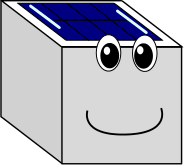

We're building 300 weather and air quality stations for the Baltimore area. 
The stations measure temperature, relative humidity, ozone, and nitrogen dioxide.
We call them WeatherCubes--- we plan to place them throughout the Baltimore area 
and send information in near-real time to the internet.

Expect the first stations to roll out this spring and summer. 

- [News](news.md)
- [About us](about.md)

### How can you get involved? 
Interested in hosting a station in your neighborhood? Or hosting a workshop? 
Get in touch at baltimoreopenair@gmail.com. 

### Questions? Concerns? 
Twitter: @bmoreopenair
Email: baltimoreopenair@gmail.com
